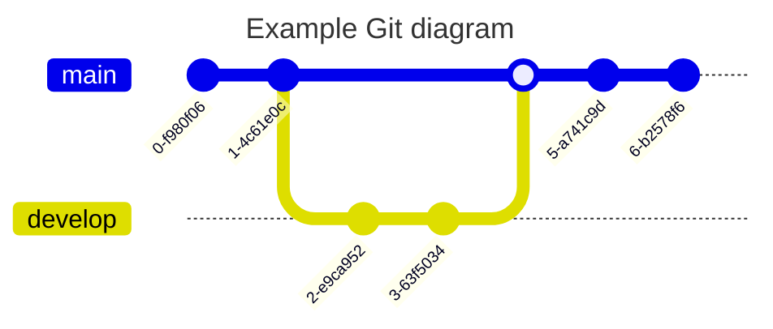

# TBD

## TL;DR

An approach to Event Sourcing that is easier and more powerful because it contains less concepts to be learned for the common cases while being more flexible towards changes to the requirements.

## Event Sourcing is simple

In essence event sourcing is about

> deriving the application state from a sequence of events

### Event

In an event-sourced system, an event is an immutable record of a state change that occurred in the past.

### State

The state of an application are built by _projecting_ the events

#### Projection

```haskell
fn (state, event) => state
```


```javascript
const events = ['ENTERED', 'ENTERED', 'LEFT', 'ENTERED', 'LEFT'];

const projection = (state, event) => event === 'ENTERED' ? state + 1 : state - 1;

const numberOfPeopleInVenue = events.reduce(projection, 0); // 1
```

```javascript
const numberOfPeopleInVenue = [
  'ENTERED',
  'ENTERED',
  'LEFT',
  'ENTERED',
  'LEFT',
].reduce((state, event) => (event === 'ENTERED' ? state + 1 : state - 1), 0);
```

```javascript
const projection = (state, event) => {
  switch (event) {
    case 'ENTERED':
      return {...state, entered: state.entered + 1};
    case 'LEFT':
      return {...state, left: state.left + 1};
    default:
      return state;
  }
}
const numbersEnteredAndLeft = events.reduce(projection, {entered: 0, left: 0}); // {entered: 3, left: 2}
```



## Event Sourcing is hard

Even though the core concept of ES is relatively simple, getting into ES can be hard because...

### New paradigm

events are more "natural" but most devs are used to think in terms of mutable state...

### Eventual consistency

...

Aggregates => Streams

in DCB, streams are dynamic: You specify the criteria and the event store enforces consistency for those

## Downsides

Nothing comes for free...
DCB = great power => great responsibility

### Performance

Write: classic: Expect version, now: potentially more complex query
Read: classic: Stream filter, now: potentially more complex query

### Deleting events

events are "append only" but streams can be deleted (at least in eventstore.org)..

In the classic stream-based approach it is possible to delete streams that are no longer used (for example if a customer wants to delete their data or for our CMS we clean up streams that were already published)

For both there are other ways: e.g. [crypto shredding](https://verraes.net/2019/05/eventsourcing-patterns-throw-away-the-key/) or [forgettable payloads](https://verraes.net/2019/05/eventsourcing-patterns-forgettable-payloads/) for privacy related issues and compaction (export read model to minimum required events, re-import into new ES, switch ES) to reduce storage and improve performance.


## More Examples

### Globally uniqueness (example: unique username)

### Consecutive sequence (example: invoice number)

### State machine (example: )

### Hierarchical structure (example: event-sourced tree)

### Out-of-time events (example: auto-correcting card swipe)
